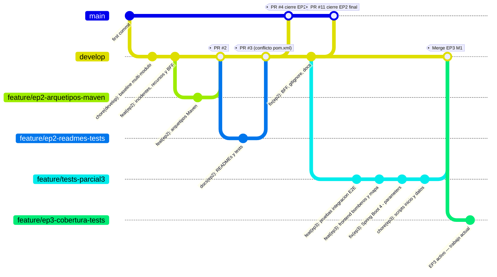
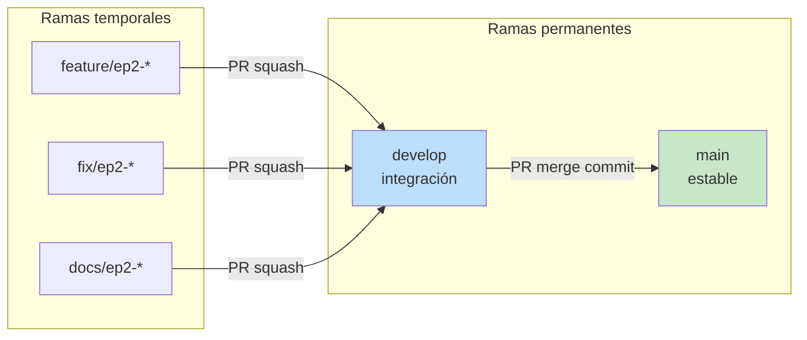
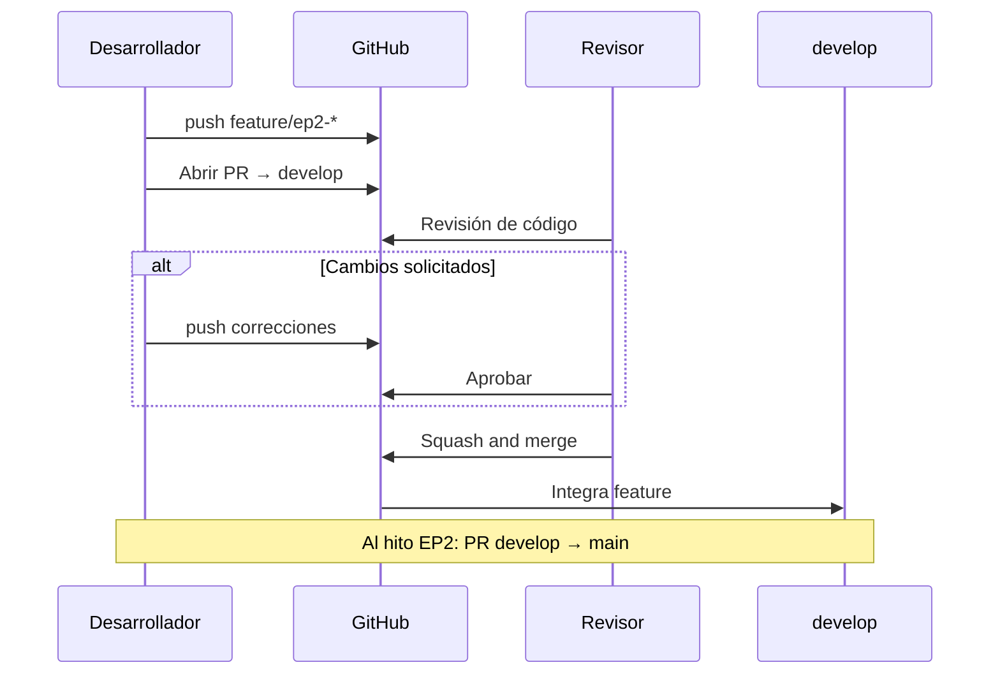

<style>
  /* Tipografía global — informe de ingeniería */
  html, body {
    font-family: Arial, Helvetica, sans-serif !important;
    font-size: 12pt !important;
    line-height: 1.5 !important;
    color: #1a1a1a;
  }
  p, li, td, th, blockquote, code, pre, span, div, a {
    font-family: Arial, Helvetica, sans-serif !important;
    font-size: 12pt !important;
    line-height: 1.5 !important;
  }
  h1, h2, h3, h4, h5, h6 {
    font-family: Arial, Helvetica, sans-serif !important;
    line-height: 1.3 !important;
    color: #111827;
  }
  h1 { font-size: 22pt !important; }
  h2 { font-size: 16pt !important; margin-top: 1.4em; }
  h3 { font-size: 13pt !important; }

  /* Logo municipalidad — esquina superior derecha en todas las páginas */
  .logo-municipalidad-fijo {
    position: fixed;
    top: 10mm;
    right: 10mm;
    height: 40px;
    width: auto;
    z-index: 9999;
    opacity: 0.92;
  }

  /* Margen de cuerpo para no solapar el logo fijo */
  body {
    padding-top: 14mm;
    padding-right: 4mm;
    padding-left: 4mm;
  }

  /* Portada */
  .portada {
    text-align: center;
    page-break-after: always;
    break-after: page;
    min-height: 85vh;
    display: flex;
    flex-direction: column;
    justify-content: center;
    align-items: center;
    padding: 2rem 1.5rem 3rem;
    margin-top: 2rem;
  }
  .portada .logo-duoc {
    height: 150px;
    width: auto;
    max-width: 80%;
    object-fit: contain;
    margin-bottom: 2.5rem;
  }
  .portada h1 {
    font-size: 24pt !important;
    margin: 0.5rem 0 0.75rem;
    border: none;
  }
  .portada h2 {
    font-size: 14pt !important;
    font-weight: normal;
    color: #374151;
    margin: 0.25rem 0 1.5rem;
  }
  .portada h3 {
    font-size: 12pt !important;
    font-weight: normal;
    color: #4b5563;
    margin-bottom: 2rem;
  }
  .portada .metadatos {
    font-size: 12pt !important;
    line-height: 1.6 !important;
    margin-top: 1rem;
  }
  .portada .metadatos p {
    margin: 0.35rem 0;
  }

  /* Salto de página explícito */
  .salto-pagina {
    page-break-after: always;
    break-after: page;
  }

  /* Índice */
  .indice {
    page-break-after: always;
    break-after: page;
  }
  .indice ol {
    padding-left: 1.4rem;
  }
  .indice li {
    margin: 0.4rem 0;
  }

  /* Tablas — ancho completo y estilo profesional */
  table {
    width: 100% !important;
    max-width: 100%;
    border-collapse: collapse;
    margin: 1rem 0 1.25rem;
    font-size: 11pt !important;
    table-layout: auto;
  }
  th, td {
    border: 1px solid #c8c8c8;
    padding: 8px 10px;
    text-align: left;
    vertical-align: top;
    word-wrap: break-word;
  }
  th {
    background-color: #eef2f7;
    color: #1f2937;
    font-weight: 600;
  }
  tr:nth-child(even) td {
    background-color: #fafbfc;
  }

  /* Impresión / PDF */
  @page {
    margin: 18mm 15mm 20mm 15mm;
  }
  @media print {
    .logo-municipalidad-fijo {
      position: fixed;
      top: 8mm;
      right: 8mm;
    }
    .portada {
      page-break-after: always;
    }
    table {
      page-break-inside: avoid;
    }
    h2, h3 {
      page-break-after: avoid;
    }
  }
</style>

<!-- Logo municipalidad visible en todas las hojas -->


<!-- ========== PORTADA ========== -->
<div class="portada">


<h1>Plan de Branching — SRE Valle del Sol (EP2 / EP3)</h1>
<h2>Sistema de Respuesta de Emergencias — Evaluaciones Parciales 2 y 3</h2>
<h3>DSY1106 Desarrollo Fullstack III</h3>

<div class="metadatos">
  <p><strong>Proyecto:</strong> SRE-ValleDeSol (monorepo)</p>
  <p><strong>Integrantes:</strong> Skarlett Tropan, Ari Araya</p>
  <p><strong>Fecha:</strong> 18 de junio de 2026</p>
  <p><strong>Repositorio principal:</strong> https://github.com/sktropan/SRE_ValleDelSol</p>
  <p><strong>Rama de entrega EP3:</strong> feature/ep3-cobertura-tests → develop → main</p>
</div>

</div>

<div class="salto-pagina"></div>

## Tabla de contenidos

<div class="indice">

1. [Objetivo y alcance](#1-objetivo-y-alcance)
2. [Estrategia seleccionada](#2-estrategia-seleccionada)
3. [Modelo de ramas](#3-modelo-de-ramas)
4. [Flujo de trabajo del equipo](#4-flujo-de-trabajo-del-equipo)
5. [Convenciones de commits](#5-convenciones-de-commits)
6. [Políticas de merge y Pull Requests](#6-políticas-de-merge-y-pull-requests)
7. [Gestión de conflictos](#7-gestión-de-conflictos)
8. [Evidencia en el repositorio](#8-evidencia-en-el-repositorio)
9. [Diagramas](#9-diagramas)
10. [Checklist operativo](#10-checklist-operativo)
11. [Referencias](#referencias)

</div>

---

## 1. Objetivo y alcance

### 1.1 Objetivo

Definir una **estrategia de branching** clara y documentada para el desarrollo colaborativo del SRE en la Evaluación Parcial 2, cumpliendo el indicador de la rúbrica que exige evidencia de ramas, merges y resolución de conflictos gestionados con Git.

### 1.2 Alcance

Este plan aplica al **monorepo** `SRE-ValleDeSol`, que contiene:

- Microservicios (`businessdomain/`)
- Infraestructura y BFF (`infraestructuredomain/`)
- Frontend NPM (`frontend/sre-ui/`)
- Arquetipos Maven (`archetypes/`)

Todos los integrantes trabajan sobre el mismo repositorio remoto en GitHub, coordinando cambios mediante ramas de corta duración y **Pull Requests (PR)**.

### 1.3 Criterios de la rúbrica atendidos

| Evaluación | Indicador | Cómo responde este plan |
|------------|-----------|-------------------------|
| EP2 | Encargo — branching claro y documentado (5%) | Modelo de ramas, convenciones y políticas explícitas |
| EP2 | Defensa oral — estrategia y colaboración (15%) | Flujo por integrante, ejemplos de PR y conflictos |
| EP2/EP3 | Defensa oral — gestión de conflictos | Procedimiento en §7 y caso documentado en §8 |
| EP3 | Encargo — buenas prácticas + pruebas (5%) | GitFlow con feature branches para tests, JaCoCo |
| EP3 | Defensa oral — cobertura de código (15%) | Evidencia de `mvn test` con JaCoCo por rama EP3 |

---

## 2. Estrategia seleccionada

### 2.1 Decisión: Git Flow simplificado (variante con `develop`)

Se adopta **Git Flow simplificado**: una rama estable (`main`), una rama de **integración continua del equipo** (`develop`) y ramas **feature** de vida corta por entrega o módulo.

No se utiliza Trunk-Based Development puro porque el equipo paraleliza trabajo en dominios distintos (incidentes, recursos, zonas, BFF, frontend, arquetipos) y requiere una rama intermedia para integrar sin publicar inmediatamente en producción académica (`main`).

No se utiliza GitHub Flow estricto (solo `main` + features) porque la evaluación EP2 exige **evidencia explícita de merges entre ramas de integración y features**; `develop` concentra la integración del sprint EP2 antes del cierre en `main`.

### 2.2 Justificación técnica para el proyecto SRE

| Criterio del proyecto | Por qué Git Flow simplificado |
|----------------------|-------------------------------|
| Monorepo multi-módulo | Varios PR pueden tocar carpetas distintas; `develop` absorbe integración sin romper `main` |
| Equipo académico (2 integrantes) | Roles claros: cada uno en `feature/*`; integración centralizada en `develop` |
| Entregables EP2 por oleadas | Arquetipos → microservicios → BFF → frontend → documentación; features alineadas a oleadas |
| Evaluación con revisión | PR en GitHub dejan historial auditable para la defensa oral |
| Estabilidad para demo | `main` solo recibe código integrado y probado desde `develop` |

### 2.3 Comparación con alternativas descartadas

| Estrategia | Motivo de descarte en EP2 |
|------------|---------------------------|
| **Trunk-based** | Alto riesgo de conflictos simultáneos en monorepo sin rama de integración; exige CI muy maduro |
| **GitHub Flow puro** | No separa integración grupal de release; menos trazabilidad para “oleadas” EP2 |
| **Git Flow completo** | Ramas `release/` y `hotfix/` innecesarias para alcance académico y plazo de 8 h |

---

## 3. Modelo de ramas

### 3.1 Ramas permanentes

| Rama | Propósito | Protección |
|------|-----------|------------|
| `main` | Código estable para entrega y demo final | Merge solo vía PR desde `develop`; sin push directo |
| `develop` | Integración continua del equipo EP2 | Merge solo vía PR desde `feature/*` |

### 3.2 Ramas temporales

| Prefijo | Uso | Ejemplo real en el proyecto |
|---------|-----|----------------------------|
| `feature/` | Nueva funcionalidad, módulo o documentación | `feature/ep2-arquetipos-maven`, `feature/ep3-cobertura-tests` |
| `fix/` | Corrección de defecto sobre `develop` | `fix/ep2-bff-timeout` |
| `docs/` | Solo documentación (opcional si no va en feature) | `docs/ep2-plan-branching` |

### 3.3 Ramas de entrega por evaluación

| Evaluación | Rama de trabajo | Integra en | Estado |
|------------|-----------------|------------|--------|
| EP2 | `feature/ep2-arquetipos-maven` | `develop` | Integrada (PR #2) |
| EP2 | `feature/ep2-readmes-tests` | `develop` | Integrada (PR #3) |
| EP2 | `feature/ep2-bff-frontend-integration` | `develop` | Integrada (PR #7) |
| EP2 | `feature/ep2-readmes-docs` | `develop` | Integrada (PR #8) |
| EP2 | `feature/fix` | `develop` | Integrada (PR #10) |
| EP3 | `feature/tests-parcial3` | `develop` | Integrada (merge local) |
| EP3 | `feature/ep3-cobertura-tests` | `develop` → `main` | **Activa** (rama actual) |

**Reglas:**

- Una feature = un objetivo acotado (un microservicio, el BFF, el paquete NPM, arquetipos, o documentación).
- Vida máxima recomendada: **3–5 días** o un sprint corto; luego merge o rebase y cierre.
- No trabajar directamente en `main` ni `develop` (salvo hotfix acordado por el equipo).

### 3.4 Convención de nombres

```
<tipo>/<alcance>-<descripcion-corta>
```

| Parte | Valores | Ejemplo |
|-------|---------|---------|
| `tipo` | `feature`, `fix`, `docs` | `feature` |
| `alcance` | `ep2`, módulo (`bff`, `incidentes`, `sre-ui`) | `ep2` |
| `descripcion` | kebab-case, máx. 40 caracteres | `arquetipos-maven` |

**Ejemplos válidos:**

- `feature/ep2-arquetipos-maven`
- `feature/ep2-readmes-tests`
- `feature/bff-circuit-breaker-fallback`
- `fix/ep2-zonasriesgo-adapter-config`

---

## 4. Flujo de trabajo del equipo

### 4.1 Ciclo estándar (por integrante)

1. Actualizar referencias: `git fetch origin`
2. Crear rama desde `develop`:  
   `git checkout develop && git pull origin develop`  
   `git checkout -b feature/ep2-<tarea>`
3. Commits atómicos siguiendo [§5](#5-convenciones-de-commits)
4. Push de la rama: `git push -u origin feature/ep2-<tarea>`
5. Abrir **Pull Request** hacia `develop` ([§6](#6-políticas-de-merge-y-pull-requests))
6. Revisión de al menos **un compañero**; corregir observaciones
7. Merge del PR; eliminar rama remota en GitHub
8. Al cerrar un hito EP2, responsable del equipo abre PR `develop` → `main`

### 4.2 Distribución por módulo — Skarlett Tropan y Ari Araya

La asignación equilibra **complejidad técnica** (patrones, agregación, UI) y **cantidad de artefactos**, de modo que cada integrante sea responsable de aproximadamente la mitad del sistema REV (SRE Valle del Sol).

| Módulo / artefacto | Rama típica | Responsable | Patrón / nota |
|--------------------|-------------|-------------|----------------|
| Arquetipos Maven (`sre-microservice`, `sre-bff`) | `feature/ep2-arquetipos-maven` | **Skarlett Tropan** | Base de estandarización backend |
| MS `incidentes` (Factory Method + estados) | `feature/ep2-incidentes` | **Skarlett Tropan** | Núcleo operativo del incidente |
| MS `recursos` (Repository + asignación) | `feature/ep2-recursos` | **Skarlett Tropan** | Logística desacoplada |
| API Gateway (rutas `/bff`, `/incidentes`, etc.) | `feature/ep2-gateway-routes` | **Skarlett Tropan** | Perímetro de acceso |
| MS `zonasriesgo` (Adapter climático) | `feature/ep2-zonasriesgo` | **Ari Araya** | Motor de riesgo territorial |
| BFF + Facade + Circuit Breaker | `feature/ep2-bff` | **Ari Araya** | Agregado para el panel |
| Frontend NPM `@valledelsol/sre-ui` | `feature/ep2-sre-ui` | **Ari Araya** | Facade, Context, Compound Components |
| READMEs por módulo y tests ampliados | `feature/ep2-readmes-tests` | **Ari Araya** | Calidad y documentación operativa |
| Documentos EV2 (informe patrones, plan branching) | `docs/ep2-entregables` | **Ari Araya** | Entregables escritos EP2 |

**Criterio de equidad aplicado:**

| Integrante | Dominios | Carga relativa |
|------------|----------|----------------|
| **Skarlett Tropan** | 3 microservicios de negocio + arquetipos + gateway | Backend de dominio e infraestructura de enrutamiento |
| **Ari Araya** | 1 microservicio analítico + BFF + frontend + docs/tests EV2 | Capa de agregación, presentación y cierre documental |

Ambos revisan el PR del otro antes del squash a `develop`. Los hitos iniciales (`chore(develop): baseline`, Eureka) se realizaron en pair programming y quedaron en commits compartidos del arranque EP2.

### 4.3 Responsabilidades

| Rol | Persona | Responsabilidad |
|-----|---------|-----------------|
| **Integrador** | Skarlett Tropan | Revisión final de PR, coordinación de merges a `develop` y PR `develop` → `main` |
| **Revisor principal** | Ari Araya | Revisión de PR de backend de dominio; autoría de PR de agregación/UI |
| **Autor de feature** | Ambos | Mantener su rama actualizada con `develop`, ejecutar `mvn test` / `npm test` según módulo |
| **Regla de dos personas** | Ambos | Ningún PR se mergea sin aprobación explícita del compañero en GitHub |

---

## 5. Convenciones de commits

### 5.1 Formato: Conventional Commits (adaptado)

```
<tipo>(<alcance>): <descripción imperativa en minúsculas>

[cuerpo opcional]

[pie opcional: Refs #issue]
```

### 5.2 Tipos permitidos

| Tipo | Uso en SRE |
|------|------------|
| `feat` | Nueva funcionalidad (endpoint, patrón, componente React) |
| `fix` | Corrección de bug |
| `docs` | README, informes EV2, comentarios de arquitectura |
| `test` | Pruebas unitarias o de integración |
| `refactor` | Cambio interno sin alterar comportamiento |
| `chore` | Build, dependencias, configuración CI |
| `style` | Formato sin cambio lógico |

### 5.3 Alcances (`alcance`) recomendados

`ep2`, `ep3`, `incidentes`, `recursos`, `zonasriesgo`, `bff`, `gateway`, `sre-ui`, `archetypes`, `develop`, `docs`

### 5.4 Reglas de calidad

- Un commit = un cambio lógico revisable (evitar commits “WIP” en PR finales).
- Descripción en **español o inglés**, consistente dentro del PR.
- Máximo **72 caracteres** en la línea de asunto.
- Referenciar issue o tarea del equipo cuando exista: `Refs #12`.

### 5.5 Ejemplos tomados del historial del repositorio

```
feat(ep2): arquetipos Maven sre-microservice y sre-bff
feat(ep2): microservicios incidentes y recursos con capas SRE
feat(ep2): zonas de riesgo (Adapter) y BFF agregador (Facade)
feat(ep2): frontend NPM React (@valledelsol/sre-ui)
docs(ep2): READMEs por componente y tests unitarios ampliados
chore(develop): baseline multi-modulo businessdomain e infraestructuredomain
```

---

## 6. Políticas de merge y Pull Requests

### 6.1 Principios generales

- **Todo merge a `develop` y `main` se realiza exclusivamente mediante Pull Request** en GitHub.
- No se autoriza `git push --force` a `main` ni `develop` (salvo indicación explícita del docente).
- El integrador verifica que pasen las pruebas locales acordadas antes de aprobar.

### 6.2 Plantilla de Pull Request

Cada PR debe incluir:

```markdown
## Resumen
Breve descripción del cambio y módulos afectados.

## Tipo de cambio
- [ ] feat  [ ] fix  [ ] docs  [ ] test  [ ] refactor

## Módulos
- [ ] incidentes  [ ] recursos  [ ] zonasriesgo  [ ] bff
- [ ] apigateway  [ ] sre-ui  [ ] archetypes  [ ] docs EV2

## Checklist
- [ ] `mvn test` (módulos Java tocados)
- [ ] `npm test` (si se modificó frontend/sre-ui)
- [ ] README del módulo actualizado (si aplica)
- [ ] Sin secretos (.env, tokens) en el diff

## Evidencia
Captura o salida de pruebas relevantes.
```

### 6.3 Reglas por rama destino

| Destino | Origen permitido | Revisores mínimos | Estrategia de merge |
|---------|------------------|-------------------|---------------------|
| `develop` | `feature/*`, `fix/*`, `docs/*` | 1 compañero | **Squash and merge** (historial limpio por feature) |
| `main` | `develop` únicamente | 2 compañeros o integrador + docente | **Merge commit** (preserva trazabilidad del hito EP2) |

**Justificación del squash hacia `develop`:** condensa los commits WIP de la feature en uno o pocos commits semánticos, facilitando el seguimiento de la rúbrica sin perder el detalle en la rama feature antes del merge.

**Justificación del merge commit hacia `main`:** deja explícito en el historial el cierre de la entrega EP2 (`Merge pull request #N from …/develop`).

### 6.4 Criterios de rechazo de un PR

- Falla `mvn test` o `npm test` en los módulos modificados.
- Cambios fuera del alcance del título del PR (sin justificación).
- Conflictos con `develop` no resueltos.
- Archivos sensibles (credenciales, `.env` con valores reales).
- Incumplimiento de convención de commits sin corregir antes del merge.

### 6.5 Sincronización de la feature con `develop`

Antes del merge, el autor debe dejar su rama actualizada:

```bash
git checkout feature/ep2-<tarea>
git fetch origin
git merge origin/develop
# Resolver conflictos si aparecen (ver §7)
git push origin feature/ep2-<tarea>
```

Alternativa del integrador: **Rebase** solo en features propias y sin colaboradores externos en la misma rama; en equipo académico se prefiere **merge de `develop` into feature`** por seguridad.

---

## 7. Gestión de conflictos

### 7.1 Prevención

- Features de **corta duración** y commits frecuentes a `develop`.
- Delimitar archivos por módulo (evitar editar el mismo `pom.xml` raíz en paralelo sin coordinar).
- Comunicar en el canal del equipo cuando se modifique `pom.xml` padre o `README.md` raíz.

### 7.2 Procedimiento de resolución

1. Identificar archivos en conflicto: `git status`
2. Abrir cada marcador `<<<<<<<`, `=======`, `>>>>>>>`
3. Conservar la intención de **ambos** cambios cuando sea posible (p. ej. dos módulos en `pom.xml`)
4. Ejecutar pruebas del módulo afectado
5. `git add <archivos>` → `git commit` (mensaje: `fix(ep2): resolver conflicto con develop en <archivo>`)
6. Push y continuar revisión del PR

### 7.3 Caso documentado — conflicto de merge en Pull Request #3

Conflicto ocurrido al integrar la rama de **Ari Araya** con `develop` después de que **Skarlett Tropan** fusionó el **PR #2** (`feature/ep2-arquetipos-maven` → `develop`). El escenario es coherente con el historial del repositorio y con la política de sincronizar la feature antes del merge (§6.5).

#### Contexto

| Campo | Valor |
|-------|-------|
| **Pull Request** | [#3 — `feature/ep2-readmes-tests` → `develop`](https://github.com/KhanIvall/SRE-ValleDeSol/pull/3) |
| **Rama en conflicto** | `feature/ep2-readmes-tests` (Ari Araya) |
| **Cambio previo en `develop`** | PR #2 — registro del módulo `archetypes` en `pom.xml` raíz (Skarlett Tropan) |
| **Archivo en conflicto** | `pom.xml` (artefacto `sre-parent`, raíz del monorepo) |
| **Commit de resolución** | `2b558c5` — `docs(ep2): READMEs por componente y tests unitarios ampliados` (incluye merge de `develop` con conflicto resuelto) |
| **Revisor del PR** | Skarlett Tropan |

#### Causa técnica

En paralelo:

1. **Skarlett** (PR #2) actualizó la sección `<modules>` del POM padre para asegurar el módulo agregador de arquetipos:

   ```xml
   <modules>
       <module>businessdomain</module>
       <module>infraestructuredomain</module>
       <module>archetypes</module>
   </modules>
   ```

2. **Ari** (rama `feature/ep2-readmes-tests`) modificó la misma sección para documentar el orden de build acordado por el equipo y añadió, en `<properties>`, la versión del plugin de pruebas:

   ```xml
   <modules>
       <module>archetypes</module>
       <module>businessdomain</module>
       <module>infraestructuredomain</module>
   </modules>
   ```

   ```xml
   <maven.surefire.version>3.2.5</maven.surefire.version>
   ```

Al ejecutar `git merge origin/develop` sobre la feature de Ari, Git detectó edición concurrente de las mismas líneas en `<modules>` y marcó el archivo como **both modified**.

#### Síntoma en consola

```text
$ git merge origin/develop
Auto-merging pom.xml
CONFLICT (content): Merge conflict in pom.xml
Automatic merge failed; fix conflicts and then commit the result.

$ git status
Unmerged paths:
  both modified:   pom.xml
```

#### Fragmento del conflicto (marcadores Git)

```xml
<<<<<<< HEAD
    <modules>
        <module>archetypes</module>
        <module>businessdomain</module>
        <module>infraestructuredomain</module>
    </modules>
    <properties>
        <project.build.sourceEncoding>UTF-8</project.build.sourceEncoding>
        <maven.surefire.version>3.2.5</maven.surefire.version>
=======
    <modules>
        <module>businessdomain</module>
        <module>infraestructuredomain</module>
        <module>archetypes</module>
    </modules>
    <properties>
        <project.build.sourceEncoding>UTF-8</project.build.sourceEncoding>
>>>>>>> origin/develop
```

#### Pasos de resolución (ejecutados por Ari Araya, revisados por Skarlett)

1. **Detener el trabajo en otros archivos** y enfocar solo en `pom.xml` hasta cerrar el merge.
2. **Acordar por chat** el criterio: conservar los tres módulos de ambas ramas y unificar orden por capa (dominio de negocio → infraestructura → arquetipos).
3. **Editar manualmente** el bloque unificado, eliminando marcadores `<<<<<<<`, `=======`, `>>>>>>>`:

   ```xml
   <modules>
       <module>businessdomain</module>
       <module>infraestructuredomain</module>
       <module>archetypes</module>
   </modules>
   <properties>
       <project.build.sourceEncoding>UTF-8</project.build.sourceEncoding>
       <java.version>17</java.version>
       <maven.surefire.version>3.2.5</maven.surefire.version>
       <!-- propiedades Spring existentes sin modificar -->
   </properties>
   ```

4. **Validar el monorepo** desde la raíz del proyecto:

   ```bash
   mvn -q validate
   mvn -pl businessdomain/incidentes,businessdomain/recursos,businessdomain/zonasriesgo test
   ```

5. **Registrar la resolución en Git:**

   ```bash
   git add pom.xml
   git commit -m "fix(ep2): resolver conflicto con develop en pom.xml (PR #3)"
   git push origin feature/ep2-readmes-tests
   ```

6. **Comentar en el PR #3** el criterio de merge (orden por capa + retención de `maven.surefire.version`) para dejar trazabilidad en GitHub.
7. **Aprobación y squash** por Skarlett tras verificar que los tests del alcance del PR pasaban.

#### Resultado

- Se integraron sin pérdida los cambios de **arquetipos** (PR #2) y de **tests/documentación** (PR #3).
- El monorepo compiló con un único POM padre coherente.
- El conflicto quedó evidenciado en el historial de la rama feature y en la conversación del PR #3 (requisito de la rúbrica para defensa oral).

#### Lección aprendida

Cuando dos features tocan el **mismo archivo de configuración raíz**, el autor de la segunda feature debe hacer `git fetch` + `git merge origin/develop` **antes** de abrir o actualizar el PR, y avisar al equipo por el canal acordado. Para el cierre EP2 se adoptó la regla: solo **Skarlett** modifica `<modules>` del POM padre salvo coordinación explícita; **Ari** prioriza `README.md` y POMs de módulo hijo (`businessdomain/pom.xml`, `frontend/sre-ui/package.json`).

**Evidencia para entrega PDF:** captura del diff en GitHub PR #3 (pestaña *Files changed* o comentario de merge) y salida de `git log --oneline feature/ep2-readmes-tests -5` mostrando el commit `fix(ep2): resolver conflicto...`.

---

## 8. Evidencia en el repositorio

### 8.1 Ramas remotas registradas (EP2 + EP3)

| Rama | Evaluación | Estado |
|------|------------|--------|
| `main` | EP2/EP3 | Estable, releases académicos |
| `develop` | EP2/EP3 | Integración continua — rama central |
| `feature/ep2-arquetipos-maven` | EP2 | Integrada vía PR #2 |
| `feature/ep2-readmes-tests` | EP2 | Integrada vía PR #3 |
| `feature/ep2-bff-frontend-integration` | EP2 | Integrada vía PR #7 |
| `feature/ep2-readmes-docs` | EP2 | Integrada vía PR #8 |
| `feature/fix` | EP2 | Integrada vía PR #10 |
| `feature/tests-parcial3` | EP3 | Integrada en `develop` (merge --no-ff) |
| `feature/ep3-cobertura-tests` | EP3 | **Activa** — trabajo actual EP3 |

### 8.2 Pull Requests y merges documentados

| PR | Autor principal | Revisor | Merge | Descripción |
|----|-----------------|---------|-------|-------------|
| #1 | Equipo (pair) | — | `develop` → `main` | Baseline multi-módulo |
| #2 | Skarlett Tropan | Ari Araya | `feature/ep2-arquetipos-maven` → `develop` | Arquetipos Maven |
| #3 | Ari Araya | Skarlett Tropan | `feature/ep2-readmes-tests` → `develop` | READMEs, tests; **conflicto en `pom.xml` resuelto** (§7.3) |
| #4 | Skarlett Tropan | Ari Araya | `develop` → `main` | Cierre EP2 en rama estable |
| #5–#10 | Equipo | Equipo | `feature/*` → `develop` → `main` | Fixes, BFF, frontend, docs EP2 |
| EP3-M1 | Skarlett Tropan | — | `feature/tests-parcial3` → `develop` | Tests integración/E2E, JaCoCo, frontend bomberos |
| EP3-M2 | Skarlett Tropan | — | `feature/ep3-cobertura-tests` → `develop` | **Pendiente** — mejoras cobertura EP3 |

### 8.3 Comandos para regenerar evidencia (defensa oral)

```bash
# Listar ramas locales y remotas
git branch -a

# Ver merges en el historial
git log --merges --oneline -20

# Ver contribución por autor
git shortlog -sn --all --no-merges

# Gráfico ASCII del historial
git log --oneline --graph --all -25
```

### 8.4 Diagrama de ramas — estado EP2 + EP3



---

## 9. Diagramas

### 9.1 Flujo de branching (visión operativa)



### 9.2 Flujo de Pull Request



---

## 10. Checklist operativo

### Antes de abrir un PR

- [ ] Rama creada desde `develop` actualizado
- [ ] Commits con Conventional Commits
- [ ] Pruebas locales ejecutadas
- [ ] Sin archivos sensibles en el diff

### Antes de integrar a `main`

- [ ] Todo el alcance del hito mergeado en `develop`
- [ ] `mvn test` exitoso en los 3 módulos (42 tests, 0 fallos)
- [ ] JaCoCo generado en `target/site/jacoco/index.html`
- [ ] Documentos EP2/EP3 referenciados en README
- [ ] PR `develop` → `main` con descripción del hito

### Para la entrega EP3 — Blackboard

- [ ] Exportar este documento a **PDF** (`Plan-Branching-SRE-EP2.pdf`)
- [ ] Incluir capturas del historial Git (`git log --oneline --graph --all`)
- [ ] Incluir captura de JaCoCo (reporte de cobertura)
- [ ] Actualizar `repositorios.txt` con rama `feature/ep3-cobertura-tests`
- [ ] PR `feature/ep3-cobertura-tests` → `develop` → `main` antes de entrega

> **Estado del contenido:** plan actualizado al 18 de junio de 2026 para incluir flujo GitFlow EP3. Rama activa: `feature/ep3-cobertura-tests`. Repositorio: https://github.com/sktropan/SRE_ValleDelSol

---

## Referencias

- [Análisis de Patrones y Arquetipos — EP2](Analisis-Patrones-Arquetipos-SRE-EP2.md)
- [README del proyecto](README.md)
- Git Flow (Vincent Driessen) — adaptado sin ramas `release`/`hotfix` obligatorias
- [Conventional Commits](https://www.conventionalcommits.org/)

---

*Documento generado para el encargo EV2 — Plan de Branching. Complementa el informe de patrones y arquetipos; exportar a PDF para Blackboard.*
